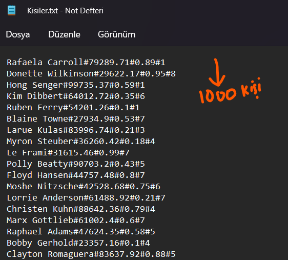
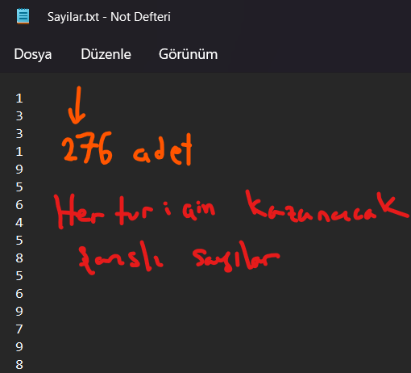
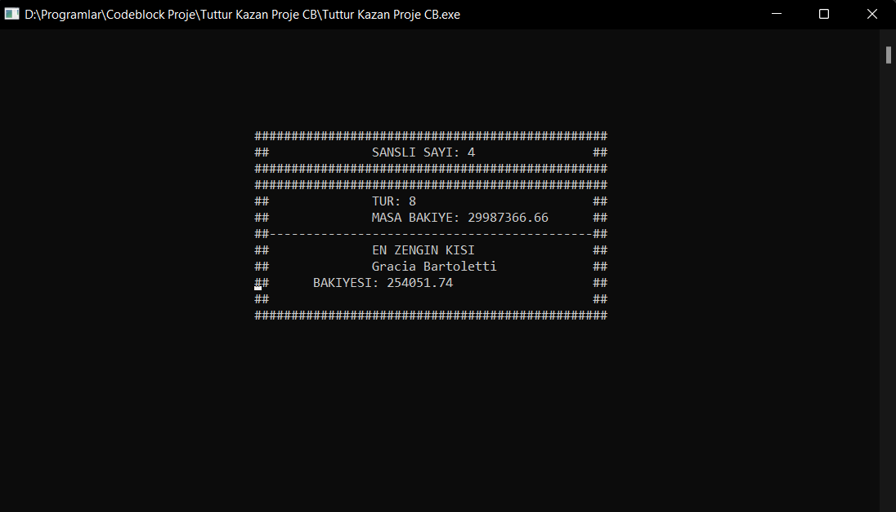
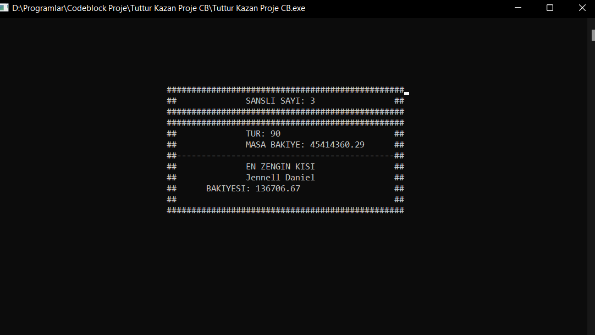

<h2 align="center">Bahis Oyunu Tuttur Kazan BahoxBet</h2>
<h3 align="center" color="Darkblue">Ahmet Bahadır Aksakal</h3>
<h4 align="center" color="Darkblue">20360859079</h4>
<h5 align="center" color="Darkblue">2. Sınıf Bahar Dönemi Projem</h5>

<ol>
  <li>
      <h3 color="Red">Projede Kullanılan Teknoloji Ve Diller:</h3>
      <ul>
        <li><strong>C</strong></li>
      </ul>
  </li>
   <li>
      <h3 color="Red">Projenin Amacı: </h3>
      <ul>
        <li>1000 Kişinin katıldığı bir bahis oyunu simüle edilmiştir.</li>
        <li>Her kullancının bilgisi <b>ad_soyad#toplam_bakiye#masaya_konan_oran#tahmin_edilen_sayi</b> örn. (<b>Rafaela Carroll#79289.71#0.89#1</b>) şeklinde formatlanmıştır. Ve bir txt belgesinin içinde alt alta bulunmaktadır.</li>
        <li>Masa her tur için kazanan bir sayıyı oluşturur. Bu sayılar önceden oluşturulmuş ve bir txt belgesinin içinde alt alta bulunmaktadır.</li>
        <li>Şanslı sayılar 1-10 arasındadır</li>
        <li>Oyuncular masadaki kazanan sayıyı doğru tahmin ederse, yatırdıkları paranın 10 katını kazanır. Aksi halde yatırdıkları parayı kaybederler.</li>
        <li>Oyuncular oyunun başında belirledikleri oran kadar bahis yapmaladırlar, yani bahis miktarı (toplam_bakiye * masaya_konan_oran) kadar olmalıdır.</li>
        <li>Oyun 278 tur sürmektedir. 278 turdan önce hiçbir oyuncu masadan ayrılamaz. Eğer ayrılırsa masadaki toplam likid varlığı kasaya geçer.</li>
        <li>Bakiyesi 1000 doların altına düşen oyuncu otomatik olarak elenir.</li>
        <li>Masa bakiyesi zaman zaman eksiye düşebilir.</li>
        <li>278 turun sonunda masa bakiyesi eksideyse kazanan oyuncuların bakiyesi İlgili-Kurum tarafından karşılanır.</li>
        <li>Tüm oyuncular masa ile rekabet halindedir. Aynı oyunda olmaları dışında bir bağlantıları yoktur.</li>
      </ul>
  </li>
  <li>
      <h3 color="Red">Görseller:</h3>
      <ul>
        <li></li>
        <li></li>
        <li></li>
        <li></li>
      </ul>
  </li>
  <li>
      <h3 color="Red">Video:</h3>
      <ul>
        <li>[<video src="Readme-img-video/Tuttur Kazan Proje.mp4"></video>](https://user-images.githubusercontent.com/72493865/169689900-ddfc2f1d-eac4-49d8-8e07-8d8e14d1e49b.mp4)
        </li>
      </ul>
  </li>
</ol>

  
    

